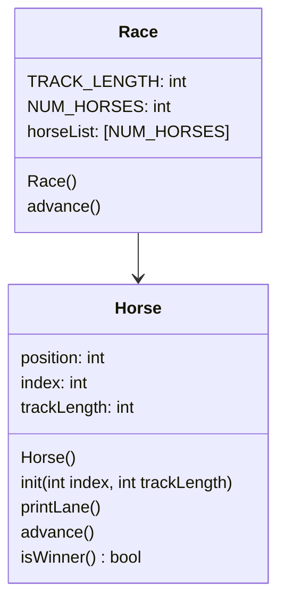

# projectFive
OOP Horse Race in C++

## UML



## Race()
```
in header
    set const static int NUM_HORSES to 5
    set constant in TRACK_LENGTH to 15
in constructor
    go through each horse
    initialize each horse by calling its init
```

## Race.start()
```
set bool keepGoing to true
while keepGoing:
    for each horse:
        advance that horse
        print horse lane
        if horse wins:
            set keepGoing to False
```

## Horse::Horse()
```
set position to 0
set index to 0
set track_length to 15
```

## void Horse::init(int index, int track_length)
```
my index = index 
my tracklength = track_length
my position = 0
```

## void Horse::advance()
```
roll a random 0-1 int called coin
add coin to position
```

## void Horse::printLane()
```
for position from 0 to track length:
    if position = my position
        print index
    else
        print "."
print newline
```

## bool Horse::isWinner()
```
bool result = false
if position >= track length
    result = true
    print line about index horse winning
return result
```
