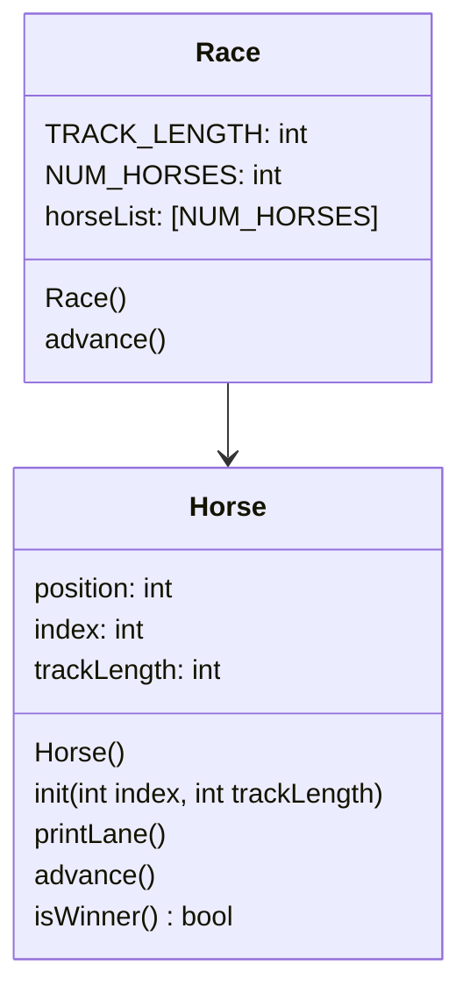

# projectFive
OOP Horse Race in C++

```mermaid
classDiagram
  class Horse {
    position: int
    index: int
    trackLength: int
    Horse()
    init(int index, int trackLength)
    printLane()
    advance()
    isWinner() bool
}

  class Race {
    TRACK_LENGTH: int
    NUM_HORSES: int
    horseList: [NUM_HORSES]
    Race()
    advance()
}

Race --> Horse
```
